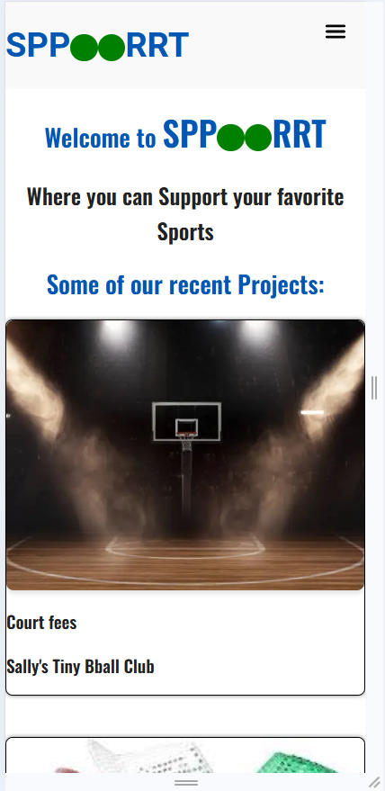
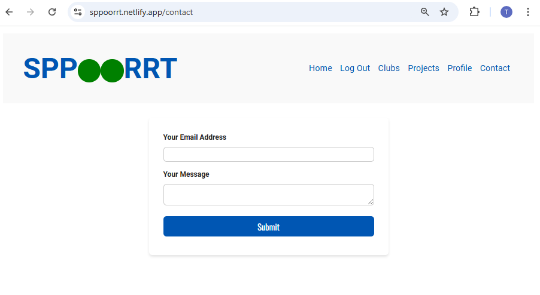
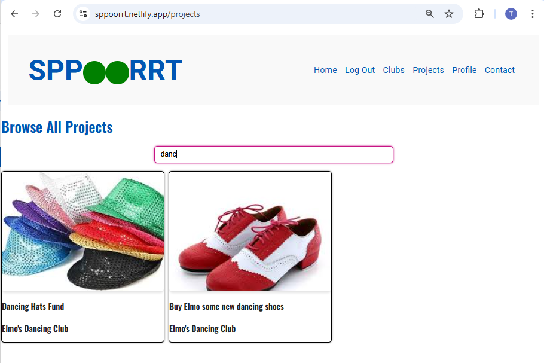
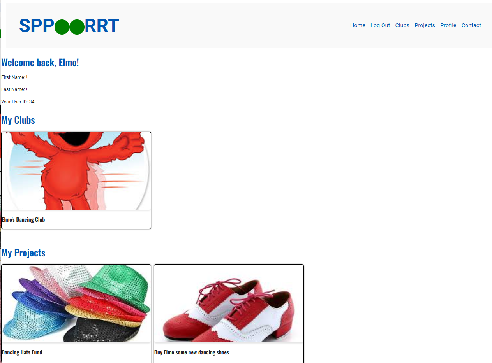
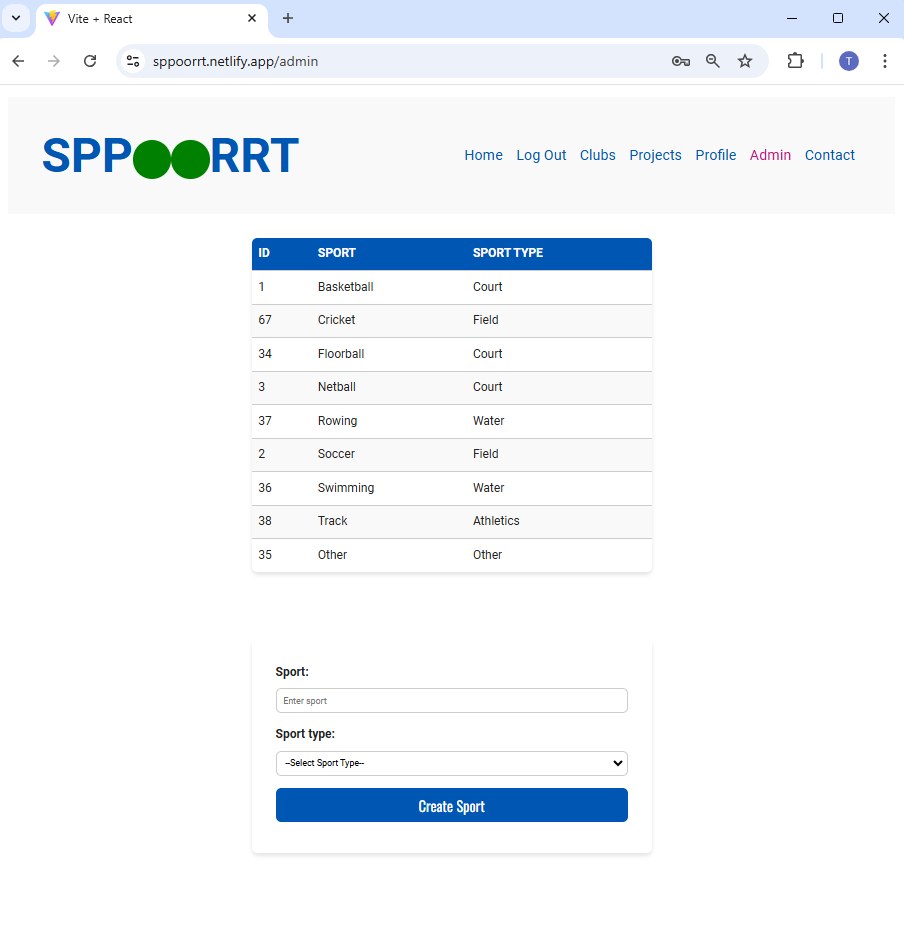

#  Tenille Scott - Front End React Project
​
https://sppoorrt.netlify.app/

Welcome to my crowdfunding project.

My project is aimed at sports clubs, giving them a platform to create fundraising projects to support the club for various purposes.

In this app, clubs have a single owner, and projects are owned by the clubs.  Both clubs and projects can only be updated or deleted by the club owner.

There is a list of sports types - these can only be updated by an admin.

The backend has an option to implement 'member only' projects allowing the concept of fundraising projects that only club members can pledge to.  In the front end, I have chosen not to use this functionality, and have not set up the ability to add club members, and have set all projects to False for the member only option.

The back end can be viewed here with more details on the setup: https://github.com/tscott-1/cf_back_end

## Homepage
Projects are sorted by most recent, and clubs are sorted by the most projects (busiest) and only the top three are displayed on the home page. There are links (buttons) to browse projects or clubs, and if you are logged in, you have the option to create your own club using a button.
The navigation bar is reactive and will show a hamburger menu at a mobile size.
When logged in, you will see the option to log out, and a profile link
when logged in as admin, you will see an admin link.

## Project creation page
### This App requires projects to be made by the club owner.
A club must be created in order to create a project - once logged in, an option to create your own club is available from both the home page and the 'clubs' page.

## If you are logged in as the club owner, you will see an option to create a project.
To create a project, you must be the owner of a club.  The create project button is available if you are logged in and the owner of the club from the club page.
Also Note the availability of update club details and delete club if you are logged in as the owner.

## Project creation form

## Unauthorised users
If you attempt to create or edit a project and you are not the club owner, you will get a message telling you to contact the club owner.
Similar behaviour is set up if you are not a club owner and try to edit a clubs details.

## Contact page
A contact page is available, this contains a form that will send an email to myself - this is setup using a formsfree account.

## Club Page and Project Page - Search
Both the club page and project page have an option to search at the top.  Typing in the search box will filter 
to projects or clubs with the name or title you are searching.

## User Page
The user page displays information about the logged in user, and gives a filtered display of clubs and projects belonging to the user.

## Admin Page
Admin page allows superusers to add different sports to the sports list. This page displays a table of the 
sports listed alphabetically.

## Future Enhancements:
- [ ] Extend Club and Project search options to cover all fields
- [ ] Make navbar floating
- [ ] Option to Edit user + Form
- [ ] Option to Edit Pledge
- [ ] Option to Delete Pledge
- [ ] Integrate ability to add club members
- [ ] Integrate member-only option
- [ ] Allow Admin to delete or edit projects and clubs
