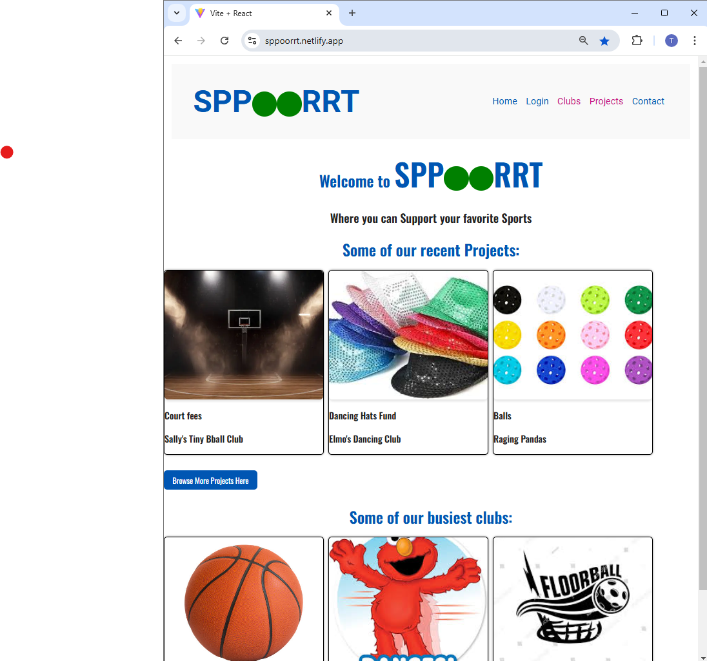
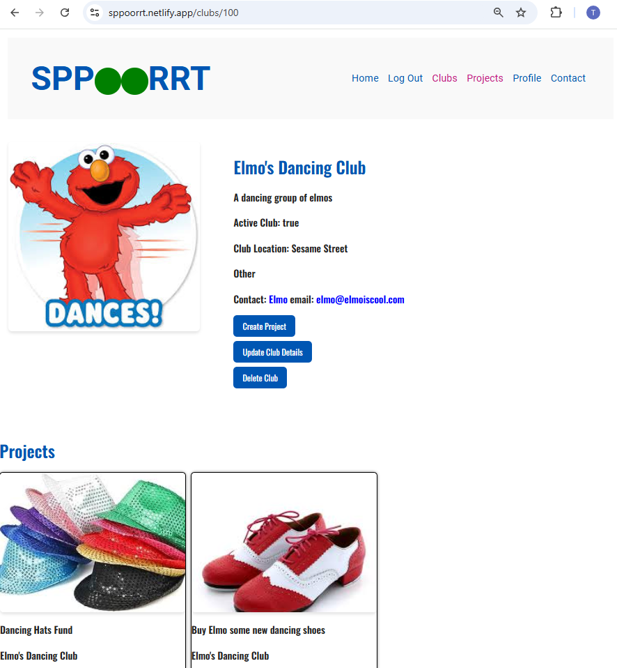

#  Tenille Scott - Front End React Project
​
https://sppoorrt.netlify.app/

## A screenshot of the homepage
#### Homepage has both Projects and Clubs available for viewing

## A screenshot of the project creation page
### This App requires projects to be made by the club owner, so a club must be created first - once logged in, an option to create your own club is

### If you are logged in as the club owner, you will see an option to create a project.

## A screenshot of the project creation form

## A screenshot of the resulting page when an unauthorized user attempts to edit a project (optional, depending on whether or not this functionality makes sense in your app!)
### If you try and create a project and you are not the club owner, you will get a message telling you to contact the club owner

ClubPage_projectButton

To Do:
- [x] Add Contact page
- [ ] Do a proper lookup for sports in clubs
- [ ] Add admin option to navbar
- [ ] Make navbar floating
- [ ] Option to Edit Club + Form
- [ ] Option to Edit Project + Form
- [ ] Option to Edit user + Form
- [ ] Option to Delete Project
- [ ] Option to Edit Pledge
- [ ] Option to Delete Pledge
- [ ] Add a project page with search
- [ ] Add a club page with search
- [ ] Handle failed requests gracefully (e.g. you should have a custom 404 page rather than the default error page).
